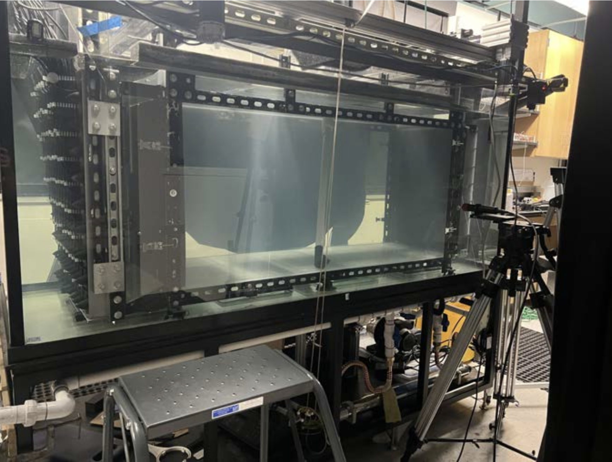
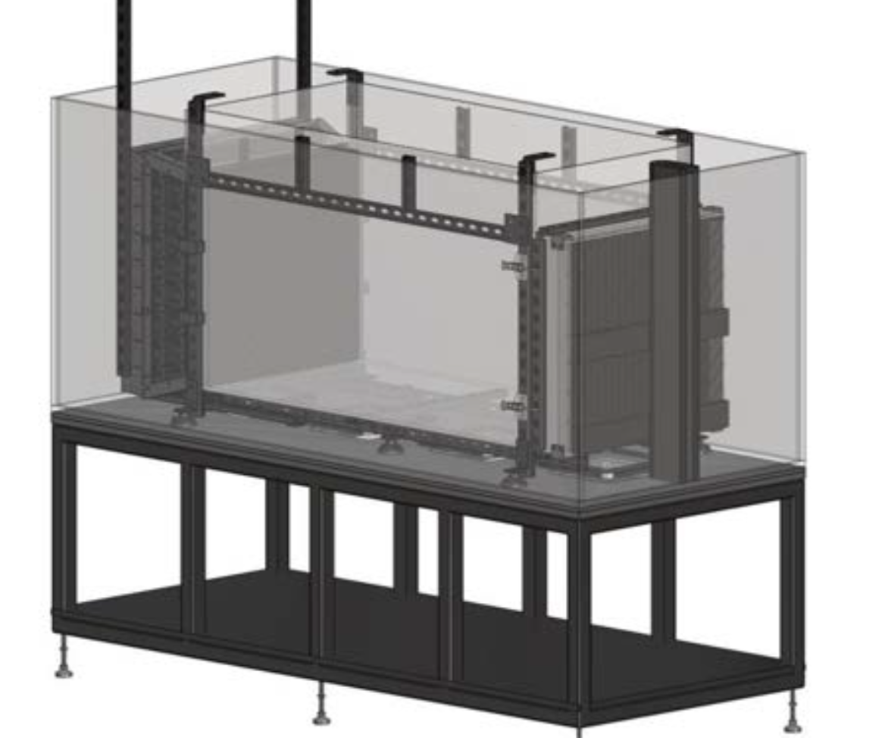
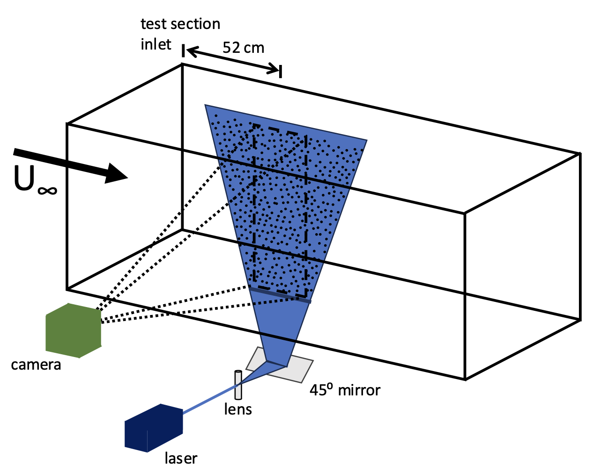
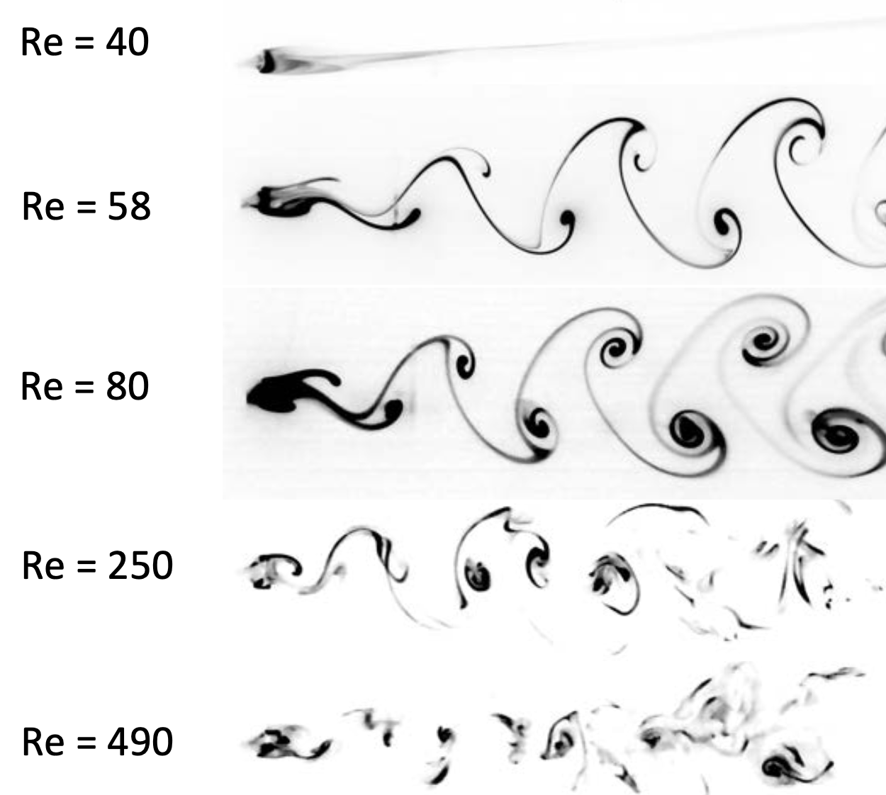

## Overview

This project involved work on a compact low-Reynolds-number water-tunnel facility designed for repeatable shear-layer and vortex-shedding experiments.

The system used a modular turbine array to generate controlled flow conditions within a compact experimental setup.

## My Role

I contributed to the hardware, electronics, power configuration, turbine-array control, and experimental validation setup.

## What I Worked On

- Modified water-tunnel hardware and turbine-array fixtures
- Worked on electronics and power configuration
- Implemented Arduino/PWM turbine-array control
- Supported PIV and dye-flow validation
- Helped prepare the system for shear-layer and vortex-shedding experiments

## Technical Areas

Experimental fluids, Arduino/PWM control, turbine arrays, wiring, power configuration, PIV, dye visualization, hardware integration.

## Media

  <a class="doc-button" href="Water%20Tunnel%20in%20a%20Box%20-%20Improvements%20to%20a%20compact%20flow%20facility.pdf">View water tunnel presentation</a>

  
  
  
  

