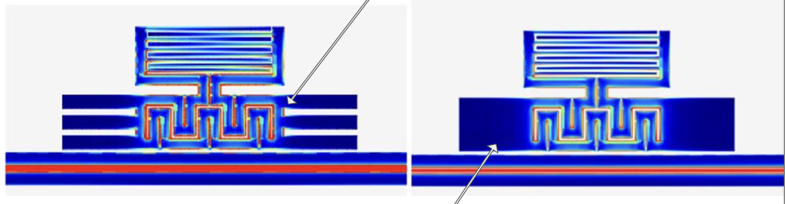
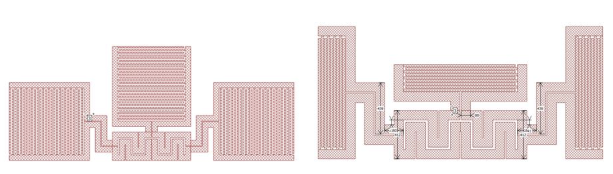
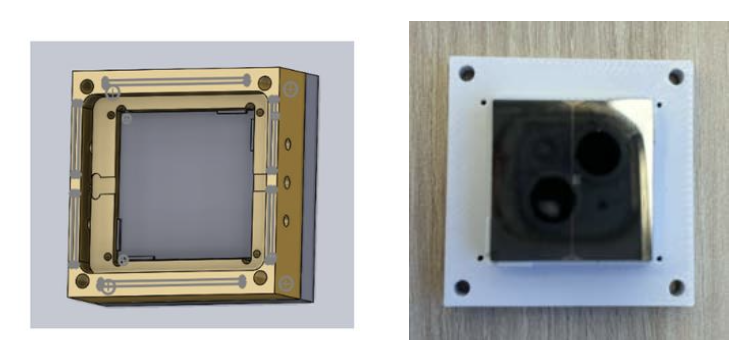

  
  

Golwala Group · Cryogenic Detectors · Summer 2024

I worked on cryogenic detector instrumentation for phonon-mediated kinetic inductance detectors, connecting detector geometry, phonon collection, CAD mounting, wire-bonded assembly, simulation, and Python-based resonator analysis.

  Cryogenic detectors
  Kinetic inductance detectors
  Phonon collection
  CAD mount design
  Wire bonding
  Sonnet/simulation
  Python
  Least-squares fitting
  Resonator analysis

  

    My work included kinetic inductance detector geometry changes, quasiparticle phonon-guide concepts, CAD mount redesign, wire-bonded assembly preparation, and Python resonance fitting. The project combined hands-on detector hardware with simulation and analysis to support improved phonon collection and resonator characterization.
  

## Report and Presentation

  

    
Project materials

    
Fermilab presentation and SURF final report

  

  

    <a class="report-button" href="Fermilab%20Presentation%20Final%20Copy%20c%20c.pdf">Open presentation</a>
    <a class="report-button" href="Hanna_Park_SURF_Final_Report%20%281%29.pdf">Open report</a>
  

## Additional Media

  

