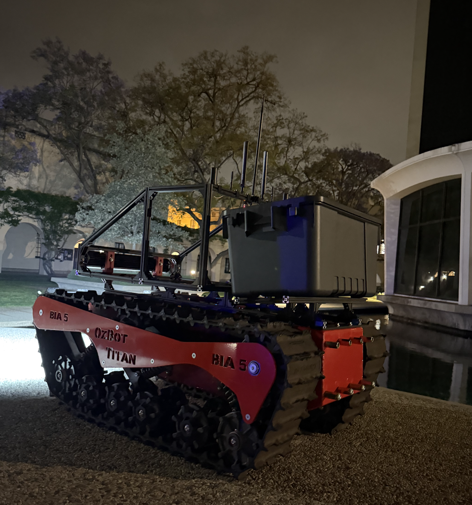

  

Gharib Group · Rapid Prototyping · Hardware Support · 2026

I support hardware development for a firefighting-related prototype through mechanical assembly, part modification, fit checks, and quick prototype iteration.

  Rapid prototyping
  Mechanical assembly
  Hardware modification
  Fit checks
  Fabrication
  Hardware integration

## Project Work

This project focuses on fast hardware iteration for a firefighting-related system. My role is mostly hands-on mechanical support: helping build, modify, and update prototype components as the system develops.

<ul>
  <li>Assembled and modified prototype hardware for testing and demonstrations.</li>
  <li>Performed fit checks and adjusted parts around packaging constraints.</li>
  <li>Supported rapid hardware changes as design needs shifted.</li>
  <li>Helped prepare mechanical components for project-level testing.</li>
  <li>Worked through practical assembly issues during prototype development.</li>
</ul>

