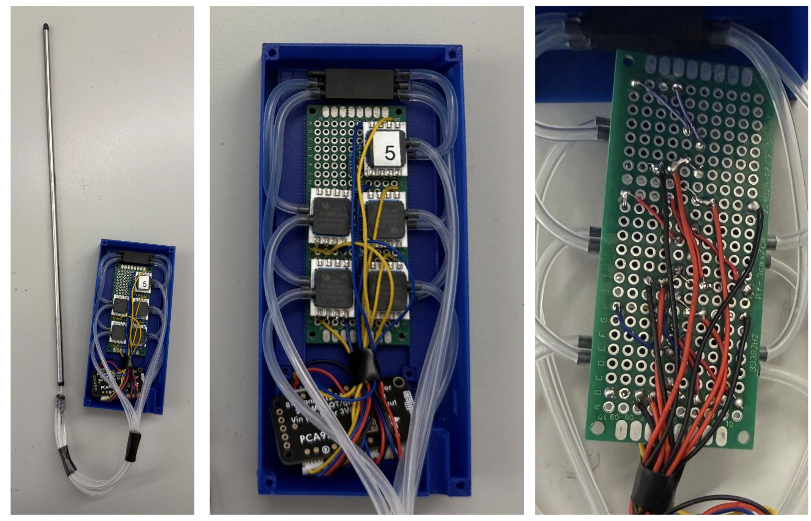
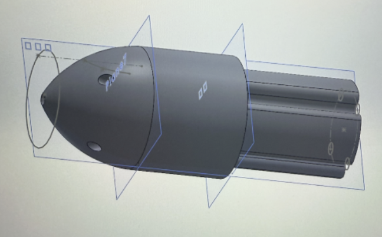
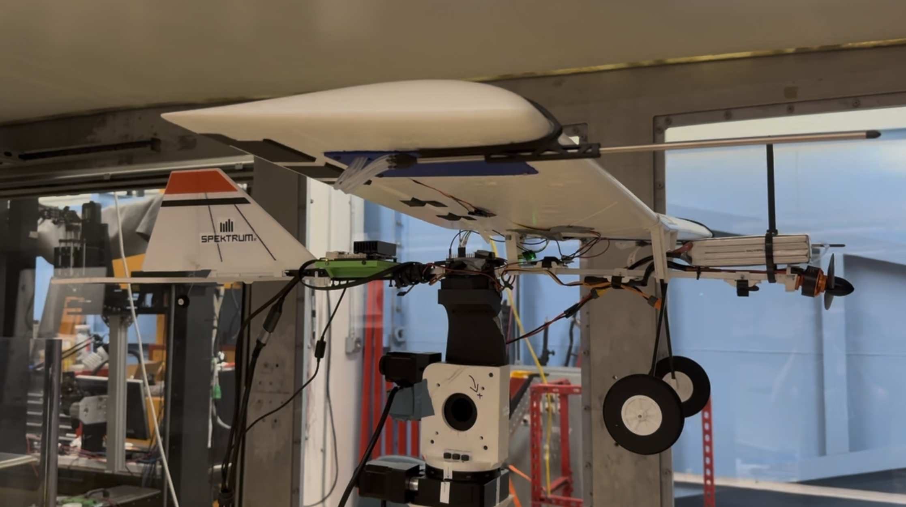
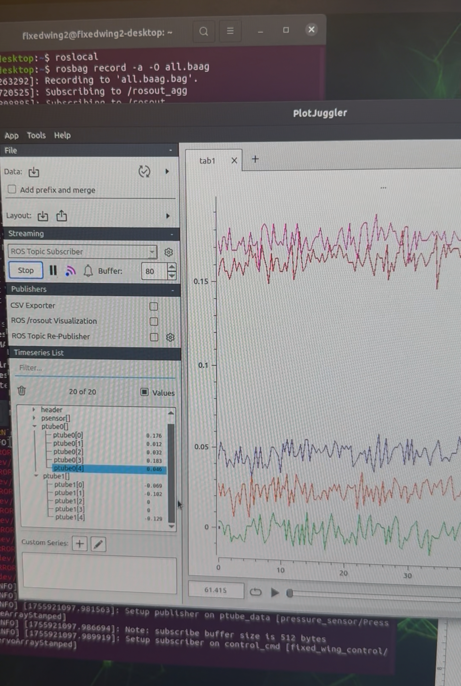
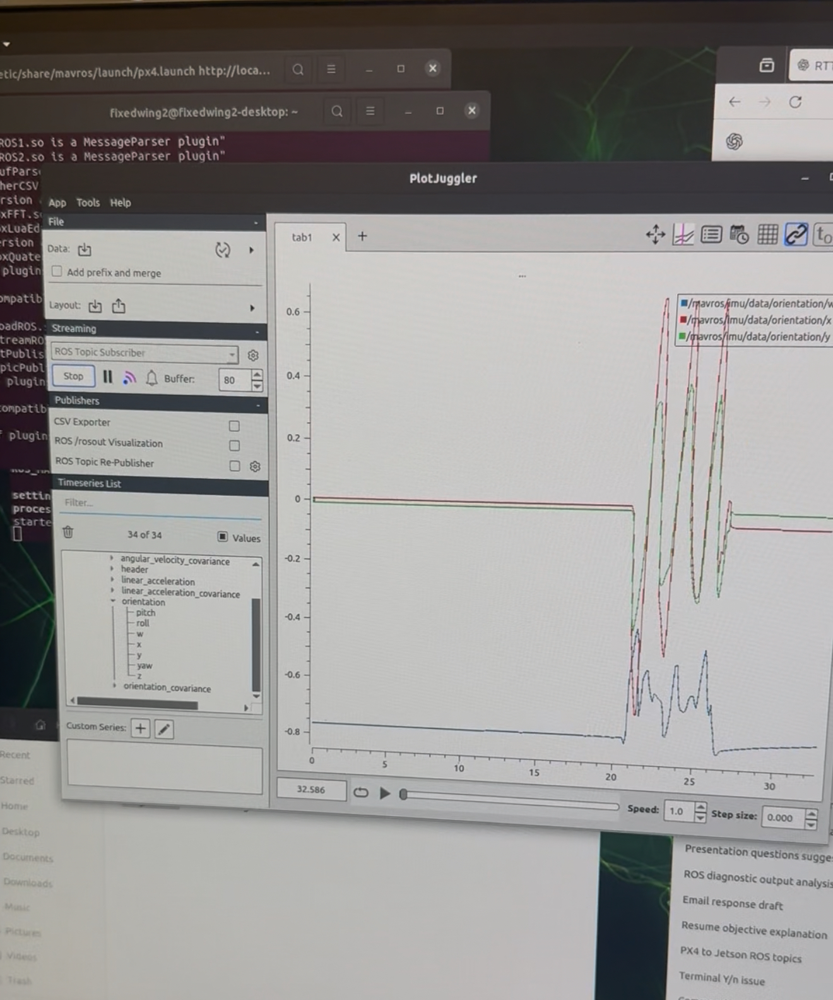

  
  

Gharib Group · Aerial Robotics · 2024–2025

I worked on a fixed-wing aerial robot test platform by integrating flight-control hardware, onboard computation, actuator systems, aerodynamic sensing, and ground-station communication.

  Fixed-wing UAV
  Cube Orange+
  Jetson
  ROS/MAVLink
  OptiTrack
  Wind-tunnel calibration

## Project Report

  

    
Project report

    
X2 Fixed-Wing Aerial Robot Report

  

  <a class="report-button" href="Hanna_Park_X2%20Report.pdf">Open report</a>

## Technical Stack

  ROS Noetic
  MAVLink/MAVROS
  QGroundControl
  Mission Planner
  Cube Orange+
  Jetson
  Teensy
  OptiTrack
  Pressure sensing
  Wind-tunnel testing

## Additional Media

  

    
  

  

    
    
  

