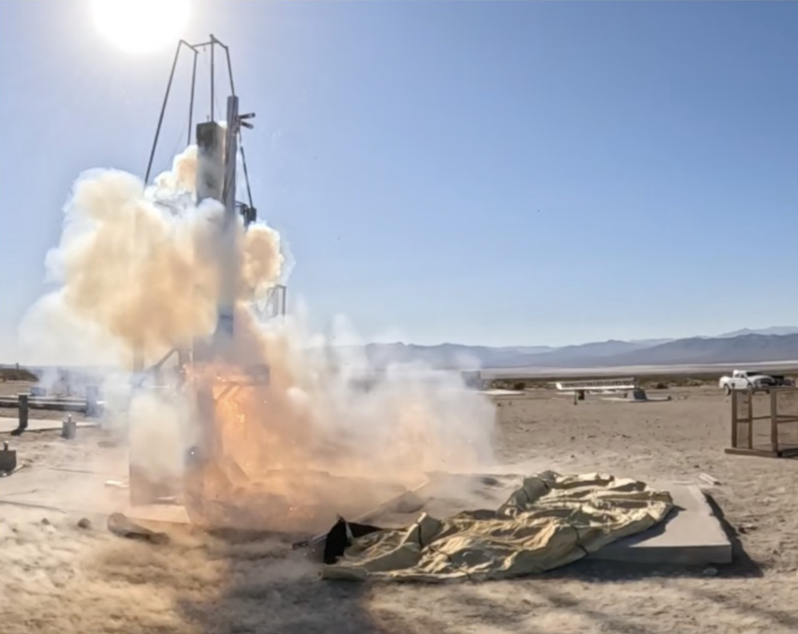
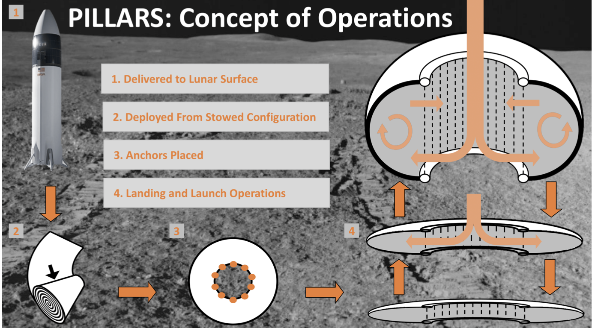

  
  

  
NASA BIG Idea Challenge Finalist Paper

  

    Read the full PILLARS proposal for more details on the concept, system design, and dust-mitigation approach.
  

  

    <a class="doc-button" href="PILLARS_Final_Paper.pdf">View PILLARS final paper</a>
  

PILLARS was a NASA BIG Idea Challenge finalist concept developed through Caltech Air and Outer Space Club. The project focused on a <strong>plume-deployed inflatable landing shield</strong> designed to reduce abrasive lunar regolith disturbance during landing. I contributed to the <strong>proposal writing and dust modeling</strong> side of the project, working across lunar systems, regolith mitigation, aerospace concept design, and team proposal development.

