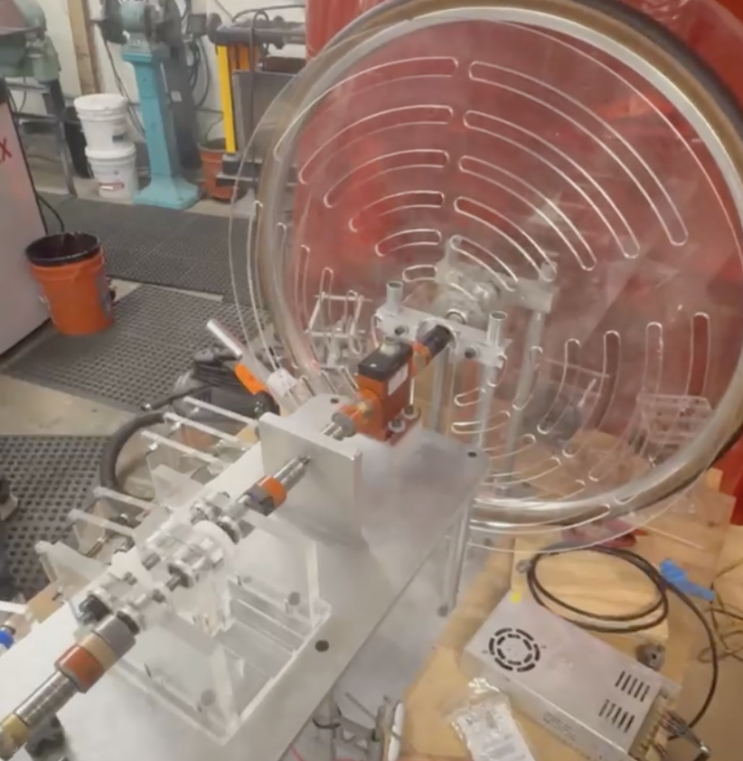
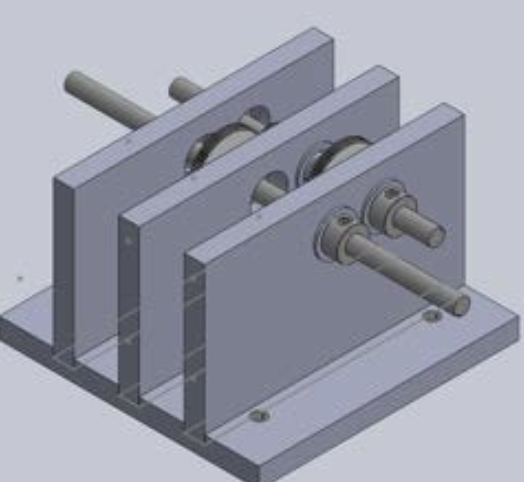

## Overview

This was a mechanical design class project focused on designing and analyzing a multi-stage gearbox.

The project connected analytical modeling, mechanical design, CAD, manufacturing planning, and design review documentation.

## My Role

I worked on MATLAB performance modeling, gear-ratio selection, CAD design, machining planning, and mechanical assembly considerations.

## What I Worked On

- Modeled gearbox performance in MATLAB
- Compared gear-ratio options
- Estimated efficiency, torque, and speed requirements
- Designed gearbox housing and shafts in SolidWorks
- Worked with keyed shafts, bearings, gears, and shaft supports
- Prepared PDR/CDR design review materials

## Technical Areas

MATLAB, SolidWorks, mechanical design, gear trains, bearings, keyed shafts, machining, design reviews.

## Media

  
  

