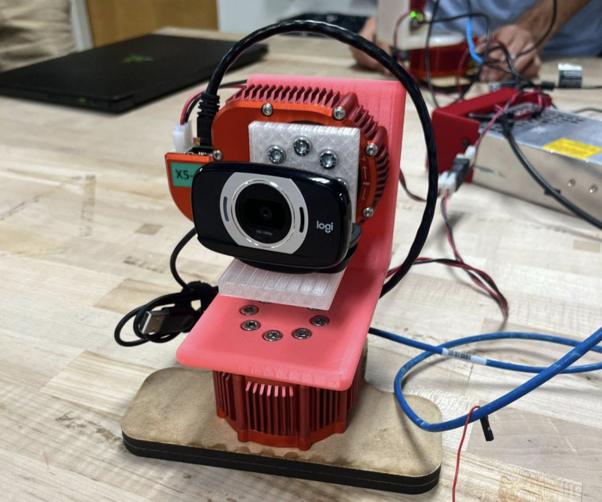

  

Robotics · Computer Vision · Motion Control

I worked on a real-time camera-guided tracking system that used Python/OpenCV target detection and HEBI actuator control to move a pan–tilt platform smoothly.

  Python
  OpenCV
  HEBI actuators
  Target tracking
  Pan–tilt control
  Spline-based motion

## Project Work

This project connected computer vision, motion control, and hardware integration. I used Python/OpenCV to detect and track a target from camera input, then connected the visual target position to motion commands for a HEBI pan–tilt actuator setup. I also worked on smooth pan–tilt motion, live tracking tests, mechanical assembly, bracket setup, and tuning the system around practical hardware behavior.

