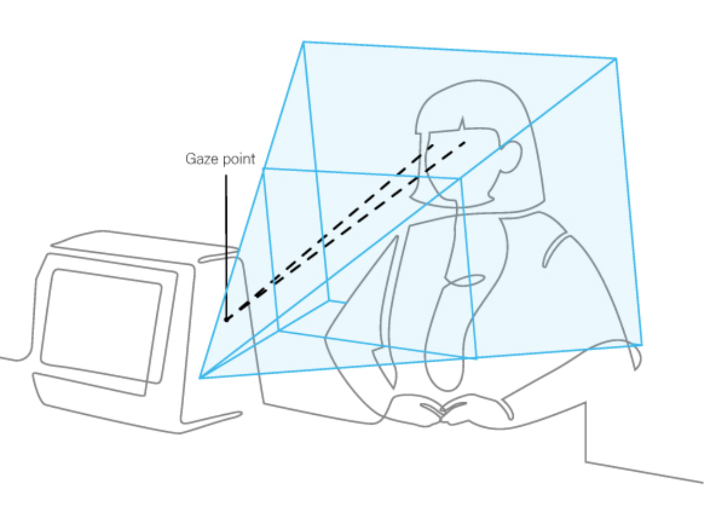
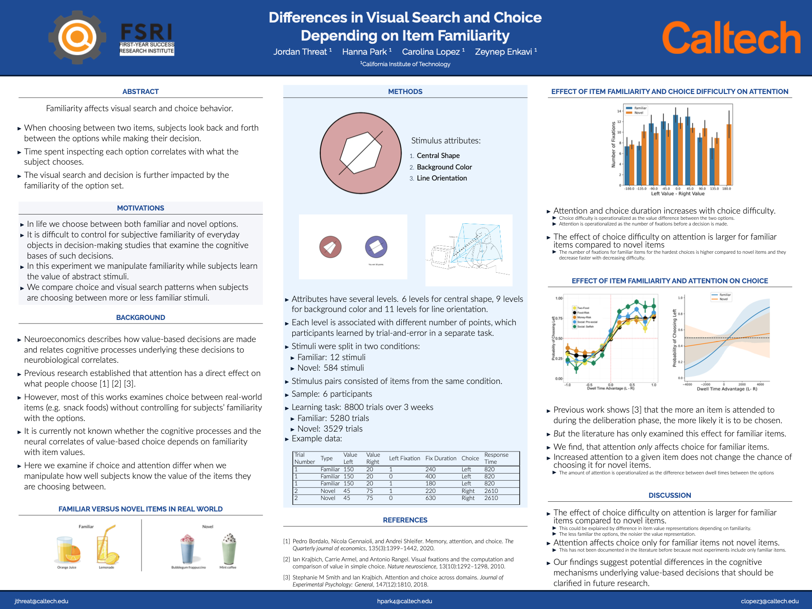

  
  

Rangel Neuroeconomics Lab · Data Analysis · 2023

I analyzed behavioral and eye-tracking data from a visual search and choice experiment, using Python and regression analysis to study how item familiarity and attention affected decision behavior.

  Python
  Pandas
  Matplotlib
  Regression analysis
  Data visualization
  Behavioral data
  Eye-tracking data
  Research poster

## Project Work

This was my first research experience at Caltech through its First-Year Success Research Institute (FSRI) in the Rangel Neuroeconomics Laboratory. I cleaned and organized behavioral data, used Python for analysis and plotting, applied regression analysis to study attention and choice difficulty, and compared familiar versus novel item behavior. I presented the work through a research symposium and poster session.

## Poster

  

    
Research poster

    
Differences in Visual Search and Choice Based on Item Familiarity

  

  <a class="report-button" href="Differences_In_Visual_Search_and_Choice_Based_on_Item_Familiarity.pdf">Open poster</a>

